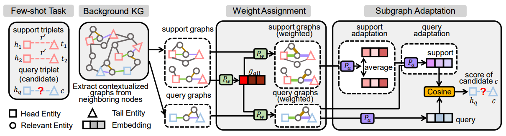

# Few-shot Knowledge Graph Relational Reasoning via Subgraph Adaptation

The codes are associated with the following paper:

>**Few-shot Knowledge Graph Relational Reasoning via Subgraph Adaptation,**     
>Haochen Liu, Song Wang, Chen Chen, Jundong Li,     
>Annual Conference of the North American Chapter of the Association for Computational Linguistics (NAACL), 2024.

<p align="center">

</p>

## 1. Environments

To install requirements:
```pip install -r requirements.txt```

## 2. Datasets

The dataset, requirements, and data preparation follow the setting of [CSR](https://github.com/snap-stanford/csr). 
Download [NELL](http://snap.stanford.edu/csr/NELL.zip), [FB15K-237](http://snap.stanford.edu/csr/FB15K-237.zip), [ConceptNet](http://snap.stanford.edu/csr/ConceptNet.zip) data and the [embeddings](http://snap.stanford.edu/csr/embedding.zip) for all datasets. 

## 3. Training

To train our SAFER model on dataset(NELL, FB15K-237, ConceptNet):

Run

    python main.py --use_atten True --use_pretrain_node_emb True --dataset <dataset> --device 0 --step pretrain2 -prev_state_dir_model2 <dataset>/train_1/checkpoint.ckpt --train_num 1 -epo 20000 

## 4. Evaluation

To test the trained SAFER model:

Run

    python main.py --use_atten True --use_pretrain_node_emb True --dataset <dataset> --device 0 --step model2 -prev_state_dir_model2 <dataset>/train_1/checkpoint.ckpt

## 5. Acknowledgment

Our code is based on the code of [CSR](https://github.com/snap-stanford/csr). Thanks to the authors and developers!

## 6. Citation
If you find this work is helpful to your research, please consider citing our paper:
```
@inproceedings{liu-etal-2024-shot,
    title = "Few-shot Knowledge Graph Relational Reasoning via Subgraph Adaptation",
    author = "Liu, Haochen and Wang, Song and Chen, Chen and Li, Jundong",
    editor = "Duh, Kevin and Gomez, Helena and Bethard, Steven",
    booktitle = "Proceedings of the 2024 Conference of the North American Chapter of the Association for Computational Linguistics: Human Language Technologies (Volume 1: Long Papers)",
    month = jun,
    year = "2024",
    address = "Mexico City, Mexico",
    publisher = "Association for Computational Linguistics",
    pages = "3346--3356",
}
```
**Thanks for your interest in our work!**


